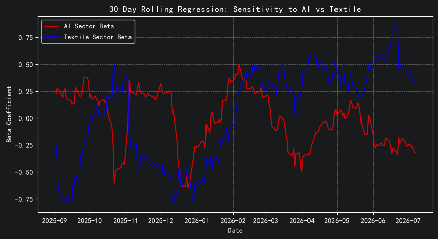
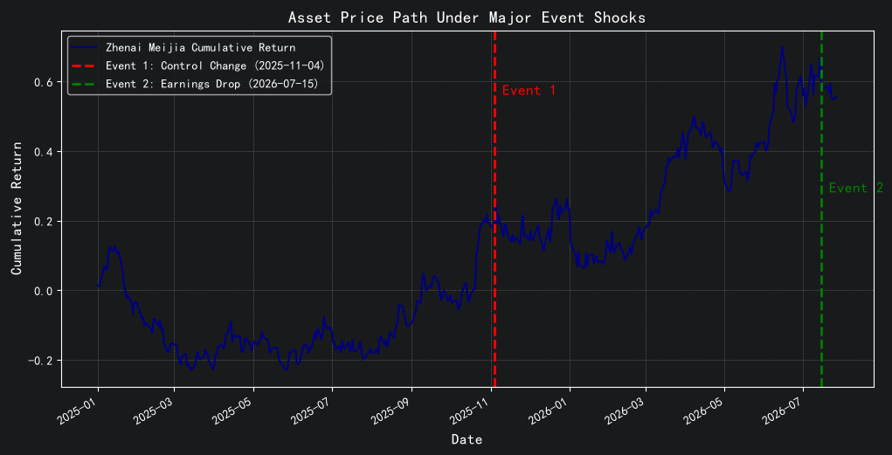

# Stock-Risk-Analysis-garch-zhenai-meijia(003041)
My family invested over 200k dollar on this! So I have been moniterd this stock for 1 year! This project use quantitative financial study on Zhenai Meijia (003041), a Chinese textile stock subject to AI takeover rumors. this project uses multi-factor OLS, rolling regressions, dummy variables, and GARCH(1,1)-VaR to evaluate pricing logic (AI vs. textile), style transitions, event shocks (M&amp;A news and earnings slumps), and dynamic tail risks.

### 1. Baseline Pricing Logic (Multi-Factor OLS)

#### 📌 Model Specification
To evaluate whether **Zhenai Meijia (003041)** is priced as a traditional textile manufacturer or driven by AI market speculation, we construct an Ordinary Least Squares (OLS) multi-factor pricing model:

$$R_t = \alpha + \beta_1 R_{\text{AI}, t} + \beta_2 R_{\text{Textile}, t} + \beta_3 R_{\text{CSI300}, t} + \varepsilon_t$$

- **Dependent Variable ($Y$)**: Daily asset returns of Zhenai Meijia ($R_{\text{zhenai}}$)
- **Independent Variables ($X$)**:
  - $R_{\text{AI}}$: AI Sector Index returns (capturing speculative sentiment)
  - $R_{\text{Textile}}$: Home Textile Sector Index returns (capturing core business fundamentals)
  - $R_{\text{CSI300}}$: CSI 300 Market Index returns (controlling for broad systemic risk)

---

#### 📊 Empirical Findings & Interpretation

| Factor | Coefficient ($\beta$) | Std. Error | $t$-statistic | $p$-value ($P>\|t\|$) | Statistical Significance |
| :--- | :--- | :--- | :--- | :--- | :--- |
| **Intercept ($\alpha$)** | 0.0008 | 0.002 | 0.502 | 0.616 | Not Significant ($p > 0.05$) |
| **AI Factor ($R_{\text{AI}}$)** | -0.0142 | 0.078 | -0.181 | 0.857 | Not Significant ($p > 0.05$) |
| **Textile Factor ($R_{\text{Textile}}$)** | 0.0485 | 0.104 | 0.467 | 0.641 | Not Significant ($p > 0.05$) |
| **Market ($R_{\text{CSI300}}$)** | 0.0805 | 0.136 | 0.592 | 0.555 | Not Significant ($p > 0.05$) |

- **Core Analysis**: In the static full-sample regression, all factor coefficients yield $p$-values well above the standard $0.05$ threshold. 
- **Methodological Takeaway**: Static full-sample linear regression fails to capture clear pricing drivers due to structural breaks over time. This empirical result strongly justifies the necessity of introducing **30-Day Rolling Regression (Section 2)** and **Dummy Variable Event Shocks (Section 3)** to capture dynamic style transitions and discrete exogenous impacts.
- --

### 2. Style Transition Timing (30-Day Rolling Regression)

#### 📌 Methodology
To capture dynamic style drift and market sentiment shifts that static full-sample OLS fails to detect, we implement a **30-day Rolling OLS Regression**. By moving a 30-trade-day window across the timeline, we estimate time-varying factor sensitivities ($\beta_{\text{AI}, t}$ and $\beta_{\text{Textile}, t}$):

$$R_t = \alpha_t + \beta_{\text{AI}, t} R_{\text{AI}, t} + \beta_{\text{Textile}, t} R_{\text{Textile}, t} + \beta_{\text{CSI300}, t} R_{\text{CSI300}, t} + \varepsilon_t$$

---

#### 📉 Dynamic Beta Trajectory

---

#### 📊 Empirical Findings & Market Style Analysis
- **Dynamic Style Drift**: Throughout 2025 and early 2026, factor sensitivities fluctuated heavily as speculative capital traded back and forth between AI shell-listing rumors and underlying business reality.
- **Recent 4-Month Trend**: 
  - **Textile Beta ($\beta_{\text{Textile}}$)**: Surged strong into positive territory, peaking above **$+0.75$**.
  - **AI Beta ($\beta_{\text{AI}}$)**: Dropped into negative territory, hovering around **$-0.25$**.
- **Financial Conclusion**: Over the past four months, market speculative fever around the AI concept completely cooled off. Market pricing logic for **Zhenai Meijia (003041)** has officially anchored back to its core **home textile business fundamentals**.

- --
### 3. Major Event Impact Analysis (Dummy Variable Regression)

#### 📌 Model Specification
To isolate and quantify structural shifts in daily abnormal returns ($\alpha$) driven by discrete corporate events—after filtering out market-wide and sector-level dynamics—we construct a Multi-Factor Dummy Variable Regression model:

$$R_t = \beta_0 + \beta_1 R_{\text{AI}, t} + \beta_2 R_{\text{Textile}, t} + \beta_3 R_{\text{CSI300}, t} + \gamma_1 D_{\text{Control}, t} + \gamma_2 D_{\text{Earnings}, t} + \varepsilon_t$$

- **Exogenous Event Indicators**:
  - $D_{\text{Control}}$: Binary dummy variable set to $1$ starting from **Nov 4, 2025** (Announcement of actual control rights change / AI M&A rumor), and $0$ otherwise.
  - $D_{\text{Earnings}}$: Binary dummy variable set to $1$ starting from **Jul 15, 2026** (H1 2026 earnings pre-announcement disclosure), and $0$ otherwise.

---

#### 📈 Asset Price Path & Event Shock Visualization

---

#### 📊 Regression Empirical Results

| Factor / Dummy | Coefficient ($\beta / \gamma$) | Std. Error | $t$-statistic | $p$-value ($P>\|t\|$) | Shift Impact |
| :--- | :--- | :--- | :--- | :--- | :--- |
| **Intercept ($\beta_0$)** | 0.0012 | 0.002 | 0.732 | 0.464 | Baseline Alpha |
| **AI Factor ($R_{\text{AI}}$)** | 0.0643 | 0.059 | 1.085 | 0.279 | Sector Control |
| **Textile Factor ($R_{\text{Textile}}$)** | -0.0272 | 0.080 | -0.341 | 0.733 | Sector Control |
| **Market ($R_{\text{CSI300}}$)** | -0.0865 | 0.097 | -0.889 | 0.374 | Market Control |
| **Event 1 ($D_{\text{Control}}$)** | **+0.0012** | 0.002 | 0.482 | 0.630 | **+0.12% / day** |
| **Event 2 ($D_{\text{Earnings}}$)** | **-0.0097** | 0.008 | -1.190 | 0.235 | **-0.97% / day** |

#### 📊 Economic Interpretation & Analysis
- **Event 1 (Control Change Announcement — Nov 4, 2025)**: Generated a positive daily abnormal return shift ($\gamma_1 = +0.12\%$), capturing speculative momentum and market expectations of an AI shell-listing.
- **Event 2 (Earnings Slump — Jul 15, 2026)**: Imposed a severe downside shock ($\gamma_2 = -0.97\%$), representing daily price re-alignment following the announcement of a massive profit drop (89.57%–92.87% YoY).

### 4. Dynamic Risk Analysis (GARCH(1,1) - VaR)

#### 📌 Model Specification
Traditional Value-at-Risk (VaR) assumes static variance, failing to account for market turmoil and risk accumulation. To capture **volatility clustering**—where high-volatility periods tend to follow high-volatility periods—we model conditional volatility using a **GARCH(1,1)** framework and compute daily **Dynamic Value-at-Risk ($\text{VaR}_t$)** at a $95\%$ confidence level:

1. **Mean Equation**: 
   $$R_t = \mu + \epsilon_t, \quad \epsilon_t \sim N(0, \sigma_t^2)$$
2. **Conditional Variance Equation**: 
   $$\sigma_t^2 = \omega + \alpha \epsilon_{t-1}^2 + \beta \sigma_{t-1}^2$$
3. **Dynamic 95% VaR Formula**: 
   $$\text{VaR}_t = -(\mu + Z_{0.95} \cdot \sigma_t)$$
   *(where $Z_{0.95} \approx 1.645$ is the 95th percentile of standard normal distribution)*

---

#### 📊 GARCH(1,1) Model Estimation Results

| Parameter | Coefficient | Std. Error | $t$-statistic | $p$-value ($P>\|t\|$) | Statistical Significance | Financial Meaning |
| :--- | :--- | :--- | :--- | :--- | :--- | :--- |
| **$\omega$ (Omega)** | 0.6766 | 1.529 | 0.442 | 0.658 | Not Significant ($p > 0.05$) | Baseline Variance |
| **$\alpha[1]$ (Alpha)** | 0.0000 | 0.0227 | 0.000 | 1.000 | Not Significant ($p > 0.05$) | Immediate News Shock Reaction |
| **$\beta[1]$ (Beta)** | **0.8818** | **0.270** | **3.266** | **0.00109** | **Highly Significant ($p < 0.001$)** | **Volatility Persistence / Memory** |
---

#### 💡 Econometric & Risk Management Takeaways
- **Strong Volatility Persistence ($\beta \approx 0.88, p < 0.001$)**: The coefficient $\beta$ is highly significant, indicating strong risk inertia in **Zhenai Meijia (003041)**. Past volatility heavily dictates future risk, meaning market panics or speculative bursts will decay slowly over time.
- **Tail Risk Quantification**: Under the current volatility regime, the portfolio manager or investor faces a predicted single-day loss of approximately **4.07%** at a $95\%$ confidence level.
